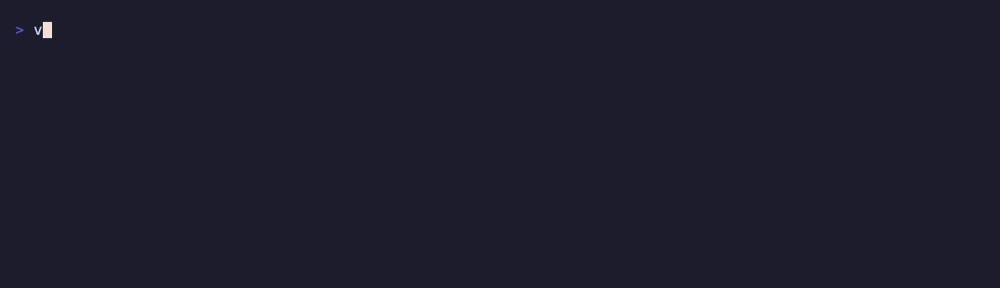

<!-- markdownlint-disable MD033 MD041 -->
<div align="center">


<em>
Then the Voom&hellip;<br>
It went VOOM!<br>
And, oh boy!<br>
What a VOOM!<br>
<br>
Now, don't ask me what Voom is.<br>
I never will know.<br>
But, boy!<br>
Let me tell you it does clean up snow!
</em>

<sub>Dr. Seuss, <em>The Cat in the Hat Comes Back</em></sub>

**Reclaim every build artifact on your disk in one parallel pass — and prove each one before deleting it.**

voom finds and removes build output anywhere in a tree: `target/`, `dist/`, `__pycache__/`,
`.gradle/`, `.zig-cache/` and the rest. A directory counts as an artifact only when a marker file
proves its ecosystem — `target/` is Rust's when a `Cargo.toml` sits beside it, and somebody's data
otherwise — so a hand-written `bin/` or `vendor/` is never taken.

Every major ecosystem · marker-anchored classification · six deletion rails · a dry run that is the
real pipeline · hierarchical TOML · a named tool-cache catalog · watch mode · git hooks

[](https://crates.io/crates/voom)
[](https://www.npmjs.com/package/@goldziher/voom)
[](https://pypi.org/project/voom-cli/)
[](https://github.com/Goldziher/voom/actions)
[](./LICENSE)
[](https://github.com/sponsors/Goldziher)

[Install](#installation)&nbsp;·&nbsp;[Safety](#safety)&nbsp;·&nbsp;[Usage](#usage)&nbsp;·&nbsp;[Caches](#cache-catalog)&nbsp;·&nbsp;[Suggest](#finding-what-the-catalog-does-not-cover)&nbsp;·&nbsp;[Ecosystems](#supported-ecosystems)&nbsp;·&nbsp;[Configuration](#configuration)&nbsp;·&nbsp;[JSON](#json-output)&nbsp;·&nbsp;[Git hooks](#git-hooks)

</div>

---

<!-- markdownlint-disable MD013 -->
<p align="center"></p>
<p align="center"><em>A <code>--dry-run</code>, then the same sweep for real — it removes exactly what it showed, because the dry run is the same pipeline with the last step withheld. Then a summary of a whole home directory.</em></p>
<!-- markdownlint-enable MD013 -->

---

## What you get

| Capability | What it does |
| --- | --- |
| **Every major ecosystem** | Rust, Node, Python, Go, Zig, Swift, Xcode, Maven, Gradle, .NET, CMake, Dart, Elixir, Ruby, PHP, Scala, Haskell, OCaml, Julia, R, Nim, Elm, Terraform, Bazel, alef, basemind — [the table below](#supported-ecosystems), or `voom catalog` for the live one |
| **Proof before deletion** | Never a directory name alone: a marker file has to prove the ecosystem at the artifact's declared anchor, or voom walks past |
| **Six deletion rails** | No symlink following, no filesystem crossing, canonicalization, an append-only protected-path denylist, containment below a scan root, and per-artifact failure isolation |
| **One pass** | Parallel traversal that prunes whole subtrees — matched artifacts, `.git/`, dependency directories, tool caches — rather than descending and filtering |
| **A report you can audit** | Sorted, per-artifact, with a reason for everything it did *not* take; `--format json` for machines; stage timings in the footer |
| **Keep policies** | `--min-age`, `--min-size`, `--max-size`, plus hierarchical `voom.toml` with per-path and per-ecosystem overrides |
| **A named cache catalog** | `voom caches` / `--clean-caches` remove machine-global tool caches by the marker the tool wrote inside them, never by path, never by default |
| **Suggestions** | `voom suggest` ranks the repeated directories a tree's own `.gitignore` names that the catalog does not cover, with the `include` line to fix it |
| **Watch mode** | Keeps a tree pruned as you work, without touching an in-progress build |
| **Git housekeeping** | `git worktree prune` and `git gc --auto` in every repository the sweep walks past, free of a second traversal |
| **Git hooks** | For `pre-commit` and poly, reporting by default |

## New since 0.2.0

- **`Anchor::Inside`** — a marker looked for *inside* the candidate rather than beside it, for
  directories that carry no sibling proof and never will: `~/.cargo/registry` has nothing next to
  it that says what it is, and neither does `.basemind/`. See [Safety](#safety).
- **`alef` and `basemind` catalog entries.** alef's `.alef/` and `.alef-cache/` anchor
  `Ancestor(6)` and are on by default; basemind's `.basemind/` anchors `Inside` on the `agent-id`
  file it writes and stays off by default, because rebuilding an index means re-embedding a whole
  repository rather than recompiling it.
- **`rust.vendor`** joins the dependency-artifact list — a `cargo vendor` tree was previously
  unreachable by any flag, not merely off by default.
- **A cache catalog: `voom caches` and `--clean-caches`.** Named machine-global tool caches,
  each proven by a marker the tool wrote inside it. See [Cache catalog](#cache-catalog).
- **`voom suggest`**, and its command-line counterpart **`--include <GLOB>`**. See
  [Finding what the catalog does not cover](#finding-what-the-catalog-does-not-cover).

Full history, including the 0.2.0 fixes to partial-removal accounting and hard-linked sizing, is
in [`CHANGELOG.md`](./CHANGELOG.md).

## Installation

| Channel | Command |
| ------- | ------- |
| Homebrew (macOS/Linux) | `brew install goldziher/tap/voom` |
| Cargo (Rust) | `cargo install voom` |
| npm (Node.js) | `npm install -g @goldziher/voom` |
| pip (Python) | `pip install voom-cli` |

The binary is called `voom` however you install it. The package names differ because `voom` was
already taken on npm and PyPI — see [ADR 0010](adrs/0010-distribution-and-naming.md).

Prefer prebuilt binaries? [`cargo binstall voom`](https://github.com/cargo-bins/cargo-binstall)
downloads a release archive instead of compiling from source.

Run without installing:

```bash
npx -y @goldziher/voom@latest --dry-run ~
uvx --from voom-cli voom --dry-run ~
```

<details>
<summary><b>Build from source</b></summary>

```bash
git clone https://github.com/Goldziher/voom.git
cd voom
cargo install --path .
```

Requires Rust 1.88+ (edition 2024).

</details>

## Quick start

```bash
voom --dry-run ~      # see what's reclaimable across everything, without touching anything
voom ~                # actually clean it up
voom ./my-project     # clean one project
```

What a run prints:

```text
/projects
  removed   4.20 GB  rust  api/target
  refused       0 B  rust  link/target    — is a symlink
  removed  18.50 MB  node  web/dist

2 artifacts, 4.22 GB reclaimed in 1.23s
  scan 900.00ms · policy 12.00ms · size 210.00ms · delete 98.00ms
  rust 4.20 GB (1), node 18.50 MB (1)
  1 artifact refused by a safety rail
```

## Usage

**voom deletes by default.** `--dry-run` previews. There is no confirmation prompt — the safety
comes from the rules below, not from a question you would learn to click through.

```bash
# Preview, with a reason for every skip
voom --dry-run --verbose ~

# Only artifacts untouched for a week
voom --min-age 7d ~

# Only Rust and Node
voom --ecosystem rust --ecosystem node ~

# Machine-readable — see JSON output below for the shape
voom --dry-run --format json ~ | jq '.totals'

# Cap parallelism (useful on spinning disks or network filesystems)
voom -j 4 ~

# Retry failed removals, repairing permissions inside the artifact
voom --force ~

# Include tool caches and installed toolchains, which are skipped by default
voom --dry-run --caches ~

# Remove named machine-global tool caches -- `voom caches` lists them
voom --dry-run --clean-caches cargo-registry,uv,go-build ~

# Sweep something the catalog does not know about
voom --dry-run --include .mytool-cache ~/projects

# Find out what that something is called
voom suggest ~/projects

# Also remove dependency directories -- node_modules/, vendor/, deps/, .venv/
voom --dry-run --clean-dependencies ~

# Skip the git housekeeping an ordinary sweep does
voom --no-git ~

# Git housekeeping on its own, including the network step a sweep will not do
voom git-prune -n --remotes ~/projects

# What does voom know about?
voom catalog

# Only the totals, and a specific configuration file
voom --summary --config ./ci-voom.toml ~/projects
```

Run `voom --help` for the full, grouped list of options, or see the
[options reference](#options-reference) below.

Exit codes: `0` clean, `1` some artifacts could not be removed (a partial removal counts, and so
does a failed `voom git-prune` repository), `2` usage or config error, `3` findings with
`--dry-run --exit-code` (for hooks). `catalog`, `caches`, `config show` and `suggest` always
exit `0`.

### Using it safely the first time

**1. Look before you sweep.** Start narrow and read what comes back:

```bash
voom --dry-run ~/projects
```

Every line names what proved the artifact. If the ecosystem column says `unanchored`, nothing proved
it — your own `include` asked for it (see [Configuration](#configuration)).

**2. Read the skips.** This is the step people miss, and the one that tells you whether voom
understands your tree:

```bash
voom --dry-run --verbose ~/projects
```

A skip says *why*: no marker proved it, a keep policy held it, an exclusion matched. A directory you
expected to be swept and cannot find in the list is one voom could not prove — usually the right
answer, occasionally a missing marker worth reporting.

**3. Run it.** The same command without `--dry-run`. Once you trust it on a project, widen to `~`.

### Guidance worth knowing

**Reach for `--min-age` on a schedule.** `voom --min-age 7d ~` in a weekly cron never touches
today's build. Without it, a scheduled run can delete something you are about to use.

**Lower `-j` on a spinning disk or a network filesystem.** voom defaults to every core, which is
right on an SSD and wrong on anything with a seek penalty or a round trip. `-j`/`--jobs` bounds the
walk, the sizing, *and* the removal, in every command that takes it.

**"Bytes reclaimed" is not the same number on every platform.** On unix voom counts allocated blocks
and counts each hard-linked inode once — `du`'s rule. On Windows it counts apparent file size, which
ignores cluster rounding, compression and sparse files, and has no portable link count to dedup by.
On a filesystem that shares blocks between clones — APFS, for instance — freeing one copy may return
less than the sum of its files.

**`--force` retries only inside the artifact.** It clears read-only bits — and on macOS the
user-immutable flag — on paths that have already passed every safety rail, then retries with a
short backoff. It never relaxes a rail, follows a symlink, or widens a hard-linked file's mode, and
it never touches the artifact's parent: one held by a read-only parent is reported, not forced. A
failure's message is written in words, classified by `io::ErrorKind` rather than the operating
system's error number, which means something different on every platform for the same condition.

**When you are unsure, prefer the false negative.** Leaving an artifact costs you gigabytes;
deleting something you wrote costs you work you cannot get back. If something is being kept that you
want gone, name it in your config deliberately rather than reaching for a broader flag.

### Options reference

Headings match `voom --help`'s own grouping.

**Behaviour**

| Flag | Short | Default | What it does |
| --- | --- | --- | --- |
| `--dry-run` | `-n` | off | Report what would be removed, without touching anything. |
| `--report` | | | Print the per-artifact report. Already the default; accepted so a git hook can name it explicitly. |
| `--exit-code` | | off | Exit `3` when a dry run finds artifacts, for a hook to fail on. |
| `--no-git` | | off | Skip `git worktree prune` and `git gc --auto` in every repository walked. Also `[git] enabled = false`; the flag wins. |
| `--force` | | off | Retry a failed removal, repairing permissions inside the artifact first. See [above](#guidance-worth-knowing). |
| `--jobs <N>` | `-j` | every core | Worker threads for the walk, sizing and removal. |

**Output**

| Flag | Short | Default | What it does |
| --- | --- | --- | --- |
| `--verbose` | `-v` | off | Explain every candidate that was passed over. |
| `--summary` | | off | Print only the totals footer. |
| `--format <human\|json>` | | `human` | `--format json` implies `--verbose` and suppresses the scan spinner — see [JSON output](#json-output). |
| `--color <auto\|always\|never>` | | `auto` | `auto` colorizes when stdout is a terminal, honouring `NO_COLOR` and `CLICOLOR_FORCE`. |

**Selection**

| Flag | Short | Default | What it does |
| --- | --- | --- | --- |
| `--ecosystem <ID>` | `-e` | all | Only sweep this ecosystem. Repeatable. |
| `--enable <SPEC>` | | | Turn on an off-by-default artifact, e.g. `python.venv`. Repeatable. |
| `--disable <SPEC>` | | | Turn off an ecosystem or one of its artifacts. Repeatable. |
| `--clean-dependencies` | | off | Also remove `node_modules/`, composer and Go `vendor/`, mix `deps/` and Python virtualenvs. Sugar over `--enable`-ing each. |
| `--exclude <GLOB>` | | | Never scan this path. Repeatable. Relative to the tree being swept. |
| `--include <GLOB>` | | | Remove this path whether or not a marker proves it. Repeatable. Outranks every prune, cannot reach inside a pruned directory, and `--exclude` still wins. |
| `--clean-caches <IDS>` | | | Remove these named tool caches. Repeatable, or comma-separated — see `voom caches`. |
| `--caches` | | off | Also sweep tool caches and installed toolchains, which are skipped by default. |
| `--config <PATH>` | | discovered hierarchy | Use this configuration file instead of resolving `voom.toml` from the tree. |

**Keep policies**

| Flag | Default | What it does |
| --- | --- | --- |
| `--min-age <DURATION>` | unset | Never remove an artifact modified more recently, e.g. `7d`. |
| `--min-size <SIZE>` | unset | Skip artifacts smaller than this, e.g. `1MB`. |
| `--max-size <SIZE>` | unset | Skip artifacts larger than this, e.g. `50GB`. |

**Safety**

| Flag | Default | What it does |
| --- | --- | --- |
| `--one-file-system[=BOOL]` | `true` | Stay on the scan root's filesystem. `--one-file-system=false` opts out — the `=` is required, or clap reads the next argument as a path. |

**Subcommands**

| Command | What it does |
| --- | --- |
| `voom catalog` | Print the built-in ecosystem catalog. Always exits `0`. |
| `voom caches` | Print the tool-cache table, resolved against this machine. Always exits `0`. |
| `voom config show [PATH]` | Print the fully merged, resolved configuration and the files it came from. `PATH` defaults to `.`. Always exits `0`. |
| `voom suggest [PATHS]` | Rank repeated directories a `.gitignore` names that the catalog does not cover. Removes nothing. Takes `--one-file-system[=BOOL]` and `-j`/`--jobs <N>`. Always exits `0`. |
| `voom watch [PATHS]` | Keep a tree pruned continuously. `--debounce <DURATION>` (default `5s`), `--quiet-period <DURATION>` (default `60s`). Sweep flags come from the top-level arguments. |
| `voom git-prune [PATHS]` | Run git's own housekeeping on its own. `-n`/`--dry-run`, `--remotes`, `--timeout <DURATION>`, `--expire <TIME>` (default git's own three-month `gc.worktreePruneExpire`), `--format <human\|json>`. Exits `1` if a repository's housekeeping failed. |

## Safety

This is the part that matters, because voom deletes without asking.

**1. Nothing is removed without a marker file proving its ecosystem.** `target/` is only Rust's
build output when a `Cargo.toml` sits beside it. `obj/` is only .NET's when a project file —
`*.csproj`, `*.fsproj`, `*.vbproj` or `*.sln` — sits at most three directories above it. `bin/`,
`vendor/` and `obj/` are each build output in one ecosystem and hand-written source in another; voom
leaves every unproven one alone, and `--verbose` says which marker was missing.

A marker's position relative to the candidate is one of three anchors. Most ecosystems use
`Sibling` — the marker sits beside the artifact. `Ancestor(n)` lets the marker sit up to `n`
directories above, for artifacts nested inside a project, like .NET's `obj/`. `Inside` looks for
the marker *within* the candidate itself, for directories that carry no proof beside them and
never will — nothing next to `~/.cargo/registry` says what it is, but the `CACHEDIR.TAG` cargo
writes into it does, and `.basemind/`'s `agent-id` is the same idea. That is stronger evidence
than a sibling, not weaker: the tool declared the directory regenerable itself. A candidate
anchored `Inside` with no marker inside it is reported as `no_inner_marker`, not `no_marker`, so
`--verbose` tells you which direction to look.

**2. Dependency directories are never touched unless you ask for them by name.** `node_modules/`,
composer's `vendor/`, Go's `vendor/`, mix's `deps/` and Python's `.venv/` are network-fetched caches,
not build output: removing one costs a re-download and breaks offline work. Every one is off by
default, and no ordinary run — however many flags it carries — takes one. `--clean-dependencies`
turns the group on and `--enable node.node_modules` turns on exactly one; voom still proves each
against its marker, so a `vendor/` with no `composer.json` beside it is left alone like anything
else.

**3. Tool caches and installed toolchains are skipped, by location.** `~/.cargo/registry`,
`~/.npm`, `~/.pyenv`, `~/miniforge3`, `~/google-cloud-sdk` and friends are machine-global or are
installed programs, not this tree's build output. An installed pnpm under `~/.cache/node/corepack`
sits beside a real `package.json` and is, to the classifier, indistinguishable from a project
someone built — so location draws the line a marker cannot. On the author's machine this is the
difference between 174 artifacts and 475. `--caches` opts back in, and naming one of those paths
as a scan root sweeps it without the flag. A named subset of these locations can also be *emptied*
by id — see [Cache catalog](#cache-catalog).

**4. Six rails you cannot switch off.** Symlinks and Windows reparse points are refused rather than
followed. Every target is canonicalized. An append-only denylist protects `/`, `$HOME` itself,
`/usr`, `/System`, `.git` and friends. The result must resolve strictly below a scan root. Filesystem
boundaries are not crossed (`--one-file-system=false` to opt out). A failure on one artifact is
reported and isolated rather than aborting the run.

**5. `--dry-run` is the real pipeline with the last step withheld**, not a simulation, so what it
prints is exactly what a real run would remove.

Full reasoning in [ADR 0002](adrs/0002-marker-anchored-classification.md) and
[ADR 0006](adrs/0006-deletion-semantics.md).

## Cache catalog

The ecosystem catalog covers build output; it has nothing to say about `~/.cargo/registry` or
`~/.cache/uv`, which are machine-global downloads rather than anything a project built. `voom
caches` lists the ones voom knows how to empty by name: cargo's registry and git checkouts, uv,
Gradle's caches, the Go build and module caches, npm, pnpm, Dart's pub cache, Deno, poly, and
alef's global cache.

| id | Cache | Location(s) |
| --- | --- | --- |
| `cargo-registry` | Cargo registry | `~/.cargo/registry` |
| `cargo-git` | Cargo git checkouts | `~/.cargo/git` |
| `uv` | uv | `~/.cache/uv` |
| `gradle-caches` | Gradle caches | `~/.gradle/caches` |
| `go-build` | Go build cache | `~/Library/Caches/go-build`, `~/.cache/go-build` |
| `go-mod` | Go module cache | `~/go/pkg/mod` |
| `npm` | npm cache | `~/.npm/_cacache` |
| `pnpm` | pnpm metadata cache | `~/Library/Caches/pnpm`, `~/.cache/pnpm` |
| `pub` | Dart pub cache | `~/.pub-cache` |
| `deno` | Deno cache | `~/Library/Caches/deno`, `~/.cache/deno`, `~/.deno` |
| `poly` | poly cache | `~/.cache/poly`, `~/Library/Caches/poly`, `~/AppData/Local/poly` |
| `alef-global` | alef global cache | `~/.cache/alef` |

The id in the first column is what `--clean-caches` and `[caches] enable` take — it is not always
the tool's name, because a cache id and an ecosystem id sharing one word would leave a report
unable to say which table a line came from.

Each is proven the same way everything else is: not by its path, but by a marker the tool wrote
*inside* it, most often the cross-tool [`CACHEDIR.TAG`](https://bford.info/cachedir/). None is on
by default and none is reachable without naming it:

```bash
voom caches                                  # the table, resolved against this machine
voom --dry-run --clean-caches uv,go-build ~  # then remove the ones you named
```

A cache whose contents are only shard directories — sccache, zig, NuGet, Maven — is deliberately
absent: the marker would prove nothing the path had not already said. [ADR
0012](adrs/0012-cache-catalog.md) says which those are and how much they hold; the fix is for
those tools to write a `CACHEDIR.TAG`, not for voom to guess.

## Finding what the catalog does not cover

The catalog covers ecosystems, not the cache your own tooling writes into every package
directory. `include` has always been the answer to that ([ADR 0004](adrs/0004-configuration.md)) —
the problem is that you have to know the directory's name to write the line, and nobody looks at
a tool cache. `voom suggest` walks a tree and reports the repeated directories **git already
ignores where they sit**, ranked by size, with the line that would sweep each:

```console
$ voom suggest ~/projects
     42.70 GB  .alef  across 69 directories
      3.00 GB  .basemind  across 13 directories

Add to voom.toml what you recognise:

  include = [".alef"]
  include = [".basemind"]
```

It removes nothing. The signal is that somebody committed the statement that these are not
source — which is the same fact that makes voom *disable* `.gitignore` when it sweeps, since a
`.gitignore` also lists `.env`, editor state and local scratch data. Good enough to rank a
suggestion, never good enough to delete on.

`--include <GLOB>` is the command-line equivalent of `voom.toml`'s `include` key, for when you
already know the name and just want to remove it once.

## Supported ecosystems

| Ecosystem | Marker | Artifacts |
| --- | --- | --- |
| Rust | `Cargo.toml` | `target/`, `vendor/`† |
| Node / TypeScript | `package.json` | `dist/`, `.next/`, `.nuxt/`, `.svelte-kit/`, `.astro/`, `.turbo/`, `.parcel-cache/`, `.vite/`, `.nyc_output/`, `*.tsbuildinfo`, `build/`†, `node_modules/`† |
| Python | `pyproject.toml`, `setup.py`, `setup.cfg` | `__pycache__/`, `.pytest_cache/`, `.mypy_cache/`, `.ruff_cache/`, `.tox/`, `*.egg-info/`, `htmlcov/`, `.coverage`, `build/`, `dist/`, `.venv/`† |
| Go | `go.mod` | `bin/`†, `vendor/`† |
| Zig | `build.zig` | `.zig-cache/`, `zig-cache/`, `zig-out/` |
| Swift | `Package.swift` | `.build/` |
| Xcode | `*.xcodeproj`, `*.xcworkspace` | `DerivedData/` |
| Maven | `pom.xml` | `target/` |
| Gradle / Kotlin | `build.gradle`, `build.gradle.kts`, `settings.gradle*` | `build/`, `.gradle/` |
| .NET | `*.csproj`, `*.fsproj`, `*.vbproj`, `*.sln` | `bin/`, `obj/` |
| CMake / C++ | `CMakeLists.txt` | `build/`, `cmake-build-*/`, `CMakeFiles/` |
| Dart / Flutter | `pubspec.yaml` | `.dart_tool/`, `build/` |
| Elixir | `mix.exs` | `_build/`, `.elixir_ls/`, `deps/`† |
| Ruby | `Gemfile`, `*.gemspec` | `.bundle/`, `vendor/bundle/`, `coverage/`, `pkg/`†, `tmp/`† |
| PHP | `composer.json` | `.phpunit.cache/`, `.phpunit.result.cache`, `vendor/`† |
| Scala / sbt | `build.sbt` | `target/`, `project/target/`, `.bloop/`, `.metals/` |
| Haskell | `*.cabal`, `stack.yaml` | `dist-newstyle/`, `.stack-work/` |
| OCaml / dune | `dune-project` | `_build/` |
| Julia | `Project.toml` | `deps/build/`† |
| R | `DESCRIPTION` | `*.Rcheck/`, `src/*.o`, `src/*.so` |
| Nim | `*.nimble` | `nimcache/` |
| Elm | `elm.json` | `elm-stuff/` |
| Terraform | `*.tf` | `.terraform/` |
| Bazel | `WORKSPACE`, `WORKSPACE.bazel`, `MODULE.bazel` | `bazel-*/` |
| alef | `alef.toml` | `.alef/`, `.alef-cache/` |
| basemind | `agent-id` | `.basemind/`†‡ |

‡ Proven from *inside*: `agent-id` is the file basemind writes into `.basemind/` when it
creates the index, so the directory declares itself rather than relying on a sibling config
that is usually absent. Every other row looks for its marker beside or above the artifact.
A tool that wants its caches swept can do the same with the cross-tool
[`CACHEDIR.TAG`](https://bford.info/cachedir/).

† Off by default — the name is also a plausible source directory in that ecosystem, or removal is
expensive rather than cheap. Turn one on for a single run with `--enable python.venv`, or per
ecosystem and per path in your config. `voom catalog` prints the live table, with the reason each
`†` entry needs an opt-in.

## Configuration

voom merges configuration from built-in defaults, `~/.config/voom/config.toml`, and every
`voom.toml` from the scan root down to each candidate — nearest wins. A repository can therefore
protect its own quirks and still be swept correctly from `$HOME`. Every table in the schema
rejects unknown fields, so a typo in a key — `excludee`, `min_agee` — is a hard load error rather
than a guard that silently never took effect.

```toml
# Top-level keys come first: TOML would otherwise read them as part of the table above.
exclude = ["~/work/client-x/**", "**/fixtures/**"]   # never scanned, always wins
include = ["~/scratch/build-junk"]                   # swept without a marker — explicit intent

[ecosystems]
enable  = ["python.venv"]     # opt into a † artifact
disable = ["terraform"]

[git]
enabled = false      # skip the housekeeping a sweep otherwise does here

[caches]
enable = ["uv"]      # opt into a named tool cache (voom caches) — additive across the hierarchy,
                      # never subtractive: a nearer file can add one, none can take one away

[keep]
min_age  = "7d"      # never remove something modified more recently
min_size = "1MB"     # not worth the rebuild below this
max_size = "50GB"    # probably not what you meant

[keep.rust]
min_age = "1d"

[[paths]]
match = "~/work/**"
keep  = { min_age = "30d" }

[[paths]]
match      = "~/experiments/**"
ecosystems = { enable = ["node.build"] }
```

Paths listed in `include` are swept without a marker proving them. That is the one place voom will
remove something it cannot prove, so it is reported as `unanchored` rather than as an ecosystem, and
JSON marks it `"source": "config-include"`. `exclude` always wins over `include`.

`include` only matches paths the walk actually visits, so it never reaches outside the roots you
named: running `voom ~/projects` with `include = ["~/scratch"]` sweeps nothing extra. It *can* name
a directory the walk would otherwise skip — a tool cache like `~/.npm`, say — and have it removed.
For a dependency directory, prefer `--clean-dependencies` or `--enable`: those still prove the
marker, and an `include` does not. It cannot reach *inside* one: skipping happens a whole directory
at a time, so `include = ["~/.npm/_cacache/pkg"]` matches nothing. Name the cache as a scan root,
or use `[caches] enable` / `--clean-caches`.

**On Windows, write paths in single quotes.** TOML basic strings take escapes, so
`exclude = ["C:\Users\me\work\**"]` fails to parse — `\U` starts a unicode escape. Use a TOML
literal string instead, which takes none:

```toml
exclude = ['C:\Users\me\work\**']
```

`voom config show [PATH]` lists the files the configuration was merged from, in ascending
precedence, and then the merged result. Details in [ADR 0004](adrs/0004-configuration.md).

## JSON output

`--format json` renders one JSON object per run on stdout; diagnostics stay on stderr, so
`voom ~ --format json | jq` works without filtering. It implies `--verbose` — a machine consumer
has no way to ask for detail after the fact — and suppresses the scan spinner. The shape is
versioned (`schema_version`, currently `3`) so a breaking change is deliberate rather than
accidental.

```bash
voom --dry-run --format json ~ | jq '.totals'
voom --format json ~ | jq '.artifacts[] | select(.outcome.status == "failed")'
```

Top level:

| Key | Type | Meaning |
| --- | --- | --- |
| `schema_version` | number | `3`. Bumped only on a breaking change. |
| `dry_run` | boolean | Whether the final step was withheld. |
| `roots` | string[] | The scan roots, as given. |
| `artifacts` | object[] | One per artifact found; see below. |
| `skipped` | object[] | `{ path, reason, detail }` for every candidate passed over — always populated in JSON. |
| `walk_errors` | object[] | `{ path, detail, transient }` per directory the walker could not read; `transient` marks an interruption (`EINTR`) rather than a real problem. |
| `totals` | object | See below. |
| `elapsed_ms` | number | The whole run, in milliseconds. `timings_us` below is the same duration broken down, in microseconds — a small tree can finish under one millisecond, at which point this alone reads `0`. |
| `timings_us` | object | Microsecond stage timings: `total`, `scan`, `policy`, `size`, `delete`, `git`. The stages do not sum to `total` — the residue is configuration loading and worker-pool setup. |
| `git` | object or `null` | What git housekeeping did. `null` when it was off, found no repositories, or the machine has no git — a consumer must test the *value*, since the key is always present. |

Each entry in `artifacts[]`:

| Field | Meaning |
| --- | --- |
| `path` | The path, as walked. |
| `ecosystem` | The catalog ecosystem id; the cache id for a `source: "cache"` entry; `null` for `config-include`. |
| `artifact` | The declared artifact path (`target/`) that matched, or `null` for `cache`/`config-include`. |
| `bytes` | Size measured before removal was attempted. |
| `unreadable_directories` | Directories inside the artifact that could not be listed — non-zero means `bytes` is a lower bound. |
| `reclaimed_bytes` | What the removal actually freed. `sum(artifacts[].reclaimed_bytes) == totals.bytes`, always. |
| `source` | `"marker"`, `"config-include"`, or `"cache"`. |
| `marker_dir` | The directory the marker was found in; `null` for `config-include` and `cache`. |
| `include_pattern` | The `include` pattern that matched; `null` unless `source` is `"config-include"`. |
| `outcome` | `{ status, ... }` — `removed`, `would_remove`, `refused` (+ `reason`, `detail`), `partially_removed` (+ `freed_bytes`, `remaining_bytes`, `os_error`, `os_message`), or `failed` (+ the same failure fields). |

`totals`: `reclaimed`, `bytes`, `skipped`, `refused`, `failed`, `partial`, `partial_bytes` (a
subset of `bytes`), `dependencies` (a subset of `reclaimed`), `unmeasured`.

## Git housekeeping

An ordinary sweep also runs git's own local housekeeping in every repository it walks past.
Discovery is free — the walker already meets `.git` on its way past — and the two steps are the ones
git itself runs after a commit:

| Step | What it does |
| --- | --- |
| `git worktree prune --expire` | drops the administration of worktrees whose checkout has been gone for three months |
| `git gc --auto` | repacks **only if** git's own thresholds say it is worth it |

Neither contacts a network. Neither expires a reflog beyond git's own policy, and voom never passes
`--prune=now`, `--aggressive`, or `git reflog expire`: the reflog is how you get a commit back, and
"prunable" does not mean "unreachable by you". The three months is git's own `gc.worktreePruneExpire`
default rather than `git worktree prune`'s, which expires everything — a checkout on an unmounted
disk is absent, and its administration holds the reflog for whatever was committed there. Every
invocation runs with hooks disabled, so a repository cannot choose what a housekeeping pass
executes. A repository with an operation half finished — a rebase, a merge, a cherry-pick, a bisect
— is skipped and said so, and a linked worktree is resolved to its object store and pruned once
rather than once per checkout.

The report says nothing when nothing was found, because that is the usual case:

```text
  pruned  api  — 2 stale worktrees pruned
```

Turn it off with `--no-git`, or with `[git] enabled = false` in a `voom.toml`, which lets one
repository set a policy for its own subtree. The flag beats the file. See
[ADR 0011](adrs/0011-git-housekeeping.md).

`voom git-prune` runs the same housekeeping on its own, and is the only place the network step
lives:

```bash
voom git-prune -n ~/projects              # what would be pruned
voom git-prune --remotes ~/projects       # also drop remote-tracking branches whose upstream is gone
voom git-prune --expire 2.weeks.ago ~/p   # a different worktree expiry
voom git-prune --timeout 30s ~/projects   # bound how long one repository's housekeeping may take
voom git-prune --format json ~/projects   # machine-readable, same shape embedded under a sweep's "git" key
```

`--remotes` is deliberately not part of a sweep: it is one network round trip per remote per
repository, which hangs without connectivity and can block on a credential prompt. A repository
whose housekeeping fails or times out makes `git-prune` exit `1`; a skip is a rail doing its job
and exits `0`.

## Watch mode

```bash
voom watch ~/projects
```

Prunes continuously as you work. Filesystem events are coalesced over a debounce window
(`--debounce`, default 5s), and an artifact is only removed once its subtree has been idle for a
quiet period (`--quiet-period`, default 60s), so an in-progress build is never touched. Watch mode
never forces. See [ADR 0008](adrs/0008-watch-mode.md).

## Git hooks

The reporting hook is the one to start with — it fails the commit on findings but deletes nothing.

<details>
<summary><b>pre-commit</b></summary>

```yaml
repos:
  - repo: https://github.com/Goldziher/voom
    rev: v0.3.1
    hooks:
      - id: voom-report      # reports, deletes nothing
      # - id: voom-prune     # actually deletes — opt in deliberately
```

</details>

<details>
<summary><b>poly</b></summary>

```toml
[[hooks.sources]]
id = "voom"
git = "https://github.com/Goldziher/voom.git"
revision = "v0.3.1"
hooks = ["voom-report"]
```

</details>

<details>
<summary><b>Lefthook</b></summary>

```yaml
pre-commit:
  commands:
    voom:
      run: voom --dry-run --report --exit-code .
```

</details>

## Performance

voom is I/O-bound, so the wins come from not walking things: it prunes matched artifacts, `.git/`,
dependency directories and tool caches at the directory level rather than descending into them, and
fans the remaining work — sizing and removal, and the inside of each artifact — across every core.

Measured with `hyperfine` on an M-series Mac against a real 144 GB `~/workspace`, dry runs, so the
walk and the size accounting are timed without the removal. This is the v0.2.0 measurement, the
last time a walk change was benchmarked end to end; the additions since (the cache catalog,
`Anchor::Inside`, `voom suggest`) touch classification and a second, opt-in traversal rather than
the hot walk, and have not moved this number:

| Version | Mean | Found |
| --- | --- | --- |
| v0.1.0 | 8.89 s | 85 artifacts |
| v0.2.0 | 6.01 s | 85 artifacts |

**1.48× faster over ten runs, finding exactly the same artifacts.** Most of it is the sizing
fan-out: a sweep's artifacts are wildly uneven — one `target/` can be most of the tree — so
per-artifact parallelism left the largest one to a single thread while every other core idled.
Dividing the work *inside* each artifact fixed that, and the reported sizes are byte-identical to
the serial walk.

`-j` genuinely throttles the whole sweep rather than just the walk, which is the point of the flag
on a spinning disk or a network filesystem. Measure your own the same way — and if you change the
walk, measure before and after on the same tree and put both numbers in the pull request.

## The name

Voom is what Little Cat Z pulls out of his hat, at the end of *The Cat in the Hat Comes Back*, to
clear every last speck of pink snow at once — quoted at the top of this page. Nobody in the book
knows what it is either.

## Development

```bash
cargo build
cargo test
cargo clippy --all-targets -- -D warnings
cargo fmt --all
poly hooks run pre-commit --all-files      # the authoritative gate
```

Design decisions live in [`adrs/`](./adrs) — start with
[0001](adrs/0001-mission-and-scope.md) and [0002](adrs/0002-marker-anchored-classification.md).
See [`CONTRIBUTING.md`](./CONTRIBUTING.md) for adding an ecosystem, which is the most common
contribution and has a checklist.

## Contributing

Issues and pull requests are welcome — especially new ecosystems, which need a marker that genuinely
proves the ecosystem and both a positive and a negative test fixture.

If voom is useful to you, consider [sponsoring development](https://github.com/sponsors/Goldziher).

## License

[MIT](./LICENSE)
